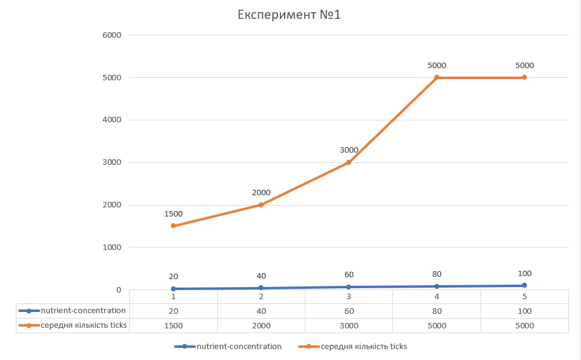
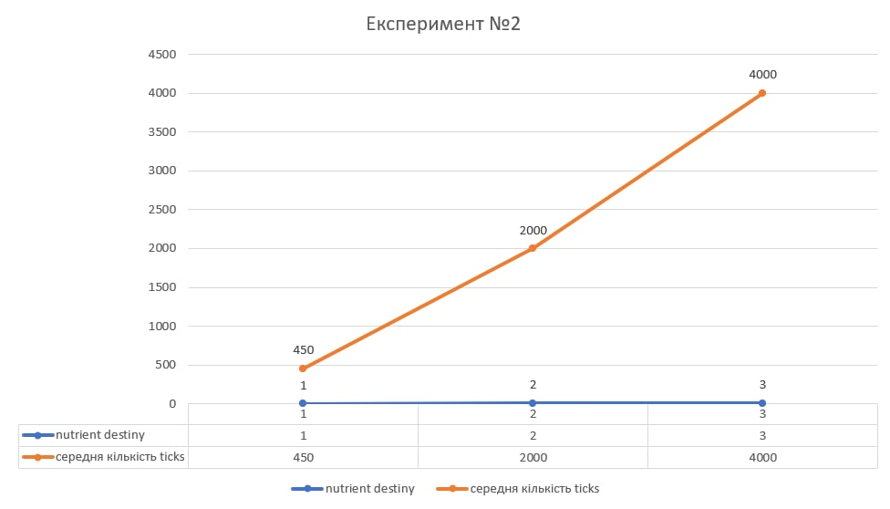
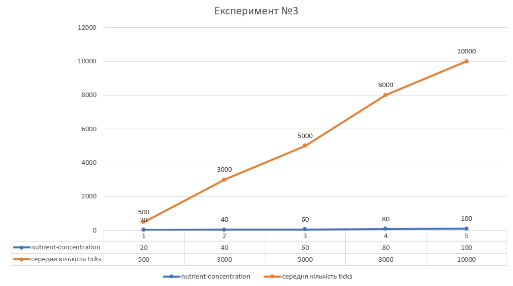

# Імітаційне моделювання комп'ютерних систем
## СПм-21-2, Лега Євгенія Сергіївна
### Додаткове завдання №**1**. Опис імітаційних моделей
 

### Обрана модель в середовищі NetLogo:

[Plant Growth](http://www.netlogoweb.org/launch#http://www.netlogoweb.org/assets/modelslib/Sample%20Models/Biology/Unverified/Plant%20Growth.nlogo)

 

### Вербальний опис моделі:
Симуляція росту рослини. Все поле поділено навпіл на сонце та воду, по середині є рослина. Рослина має коріння та листочки. Листочками рослина отримує сонячне проміння, корінням - воду. Для вдалого росту рослини, вона має отримувати поживні елементи з обох середовищ, далі рослина нарощує або листочки, або корінчики. Можна побачити та прослідкувати яким чином рослина буде еволюціонувати.

### Керуючі параметри:

- setup-plant дозволяє посадити рослину, якщо рослина була посажена, то при натисканні минула рослина зникає, а нова з'являється.
- setup-patches дозволяє створити фон з концентрацією світла та води.
- nutrient-density дозволяє регулювати щільність ділянок світла та води.
- nutrient-concentration дозволяє регулювати кількість корисних елементів у воді та світлі.
- cactus дозволяє рослині рухатися лише вверх або вниз, можливість росту в боки відсутня.

### Внутрішні параметри:
- water кількість води, що зберігається у рослині.
- sugar кількість цукру, що зберігається у рослині.
- adjacent зберігає ідентифікатор сусідньої черепахи під час поділу поживних елементів.
- moisture кількість води у ґрунті.
- light кількість світла доступно для перетворення у цукор.

### Критерії ефективності системи:
В даній моделі можливе використання щонайменще двох критеріїв ефективності. Перший критерій ефективності - це кількість черепах на полі одночасно. Тобто чим стабільніше працює система, тим більшою може вирости рослиина. Другий критерій ефективності, це кількість тіків, під час яких рослина не вмирає і залишається живою. Тобто, чим довше живе рослина, тим краще її середовище, і тим ефективніше працює система.

### Примітки:
В даній моделі дуже багато чого залежить він первинного середовища, і якщо середовище з самого початку не дозволяє рослині рости, то його потрібно змінити.

### Недоліки моделі:
У моделі присутні недоліки. Один з них це неможливість налаштовувати середовище повністю. Так є можливість змінювати кількість корисних елементів, але немає можливості змінювати їх положення. Тобто поле генерується рандомно. Інколи бувають поля, де рослина взагалі не може вижити, що не є перевагою. Окрім того, здається не досить добре налагодженим момент обрання куди саме рослина мусить рости вгору, або вниз, за декілька десятків експериментів рослина нажаль росла виключно вниз, а інколи листочки взагалі помирали. Також великим недоліком є неможливість оновити модель та промоделювати на одному і тому ж середовищі різні параметри. Для оновлення потрібно оновити патч.

 

## Обчислювальні експерименти 
### 1. Вплив показника nutrition-concentration на середній час життя рослини
Проводиться експериментЮ, яка середня кількість життя рослини при різних показниках nutrition-concentration. Показник nutrition destiny незмінний - 3. Показник cactus дорівнює нулю. nutrition-concentration змінюється в проміжку від 20 до 100 з кроком у 20. Симуляція проводиться до 15000 тіків. На кожен крок проводиться 5 симуляцій та вираховується середнє значення.

Графік показує, що даний показник досить важливий та сильно впливає на життєздатність рослини. Після позначки у 80, вплив перестає приносити якісь дуже видимі результати та середній час життя залишається незмінним. 

### 2. Вплив показника nutrient destiny на середній час життя рослини 
Проводиться експеримент, де перевіряється вплив даного показника на час життя рослини. Під час проведення експеременту показник nutrition-concentration дорівнює 50, показник cactus дорівнює нулю, а експеремент проводиться до 15000 тіків. Показник nutrient destiny може змінюватися від 1 до 3 з кроком в 1. Було проведенно по 5 запусків на кожен показник та вирахувано середнє значення.

Графік показує прямопропорційну залежність показника nutrient destiny на середню тривалість життя. Чим більше даний показник, тим довше живе рослина.

### 3. Вплив показника cactus на середню тривалість життя рослини
Проводиться експеримент, аналогічний до першого, але де показник cactus дорівнює 1. Під час даного експерименту всі показники залишаються аналогічними. Коли показник cactus дорівнює 1, це означає, що коріння або листочки рослини можуть рости лише в одному напрямку, вверх або вниз, без можливості рости в боки. 

Графік показує, що порівняно з графіком №1 тривалість життя рослини виросла. Це пов'язано з тим, що коли коріння, або листочки ростуть тільки в одному напряку є більша вірогідність знайти поживні елементи, аніж коли намагатися рости всюди. Проблема при проведенні даного експерименту була в тому, що коли корріння дістає краю поля, середовище видає помилку, адже корінню більше нікуди рости, зазвичай таке відбуваєть при більш ніж 12000 тіках.
