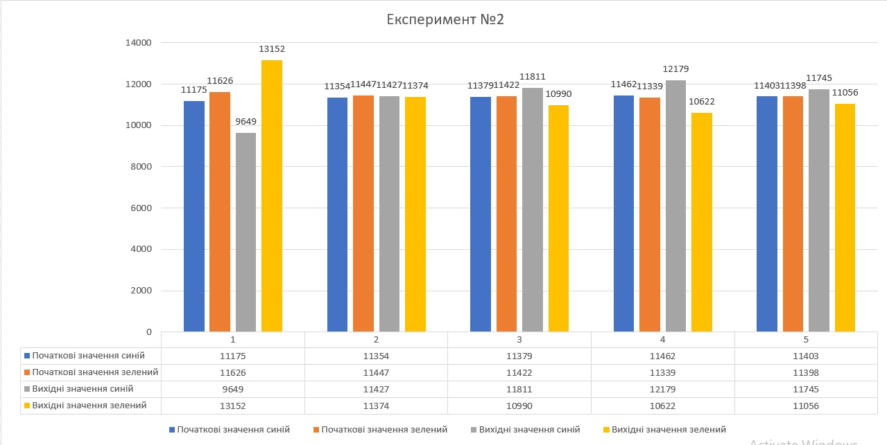

# Імітаційне моделювання комп'ютерних систем
## СПм-21-2, Лега Євгенія Сергіївна
### Додаткове завдання №**1_2**. Опис імітаційних моделей
 

### Обрана модель в середовищі NetLogo:

[Voting](http://www.netlogoweb.org/launch#http://www.netlogoweb.org/assets/modelslib/Sample%20Models/Social%20Science/Voting.nlogo)

 

### Вербальний опис моделі:
Симуляція голосування. Кожна клітинка голосує за 8 сусідів, що його оточують, та, в залежності від результату, змінювати свій голос. В моделі є два основні кольори:
синій та зелений, в залежності від того, якого кольору клітинки, що оточоють, клітинка обирає свій власний колір, тобто голосує.

### Керуючі параметри:

- change-vote-if-tied? параметр, коли дорівнює 1 змінює голос клітинки на протилежний, якщо сусіди проголосували 4-4. За замовчуванням при такому розкладі голос не змінюється
- award-close-calls-to-loser? параметр, коли дорівнює 1 при результаті голосування сусідів 5-3 віддає голос за програвшого.

### Внутрішні параметри:
- vote параметр, що містить значення власного голосу 0 або 1
- total параметр, що містить значення суми голосів усіх сусідів

### Критерії ефективності системи:
Ефективність даної системи можна виміряти кількістью часу що потрібно для повного розподілення голосів. Але дана система не мусить працювати швидко. 
Через це, пропонується інший варіант, система вважається ефективною, якщо вдалося змоделювати кінцевий результат.

### Примітки:
Під час моделювання системи з ввімкненими керуючими параметрами, система починає працювати з періодично однаковими значеннями. Тобто починається безкінечний цикл, коли деякі клітинки постійно змінюють своє значення.

### Недоліки моделі:
У моделі нажаль відсутнє відображення клітинки що вагається, тому важко відслідити, у яких саме клітин виникають проблеми з вибором. Також у моделі мало керуючих 
параметрів, можливо, було б цікаво додати можливість працювати на одному й тому самому початковому полі, для більш точного порівняння результатів.

 

## Обчислювальні експерименти 
### 1. Розподіл голосів при нормальних умовах
Було проведено 5 тестових запусків симуляції. Було записано початкові дані та дані після симуляції та порівняно результати. Усі керуючі параметри дорівнюють 0. 

На гістограмах видно, що результат в більшості залежить він початкового розподілу клітин на полі, і чим більше клітин одного кольору спочатку, тим більше вірогідність, що після голосування буде більше клітин цього самого кольору.

### 2. Розподіл голосів при увімкненому change-vote-if-tied?
Було проведено п'ять тестових запусків симуляцій. Усі дані були записані та переведені у формат гістограм.

Гістограма показує, що при увімкненому change-vote-if-tied? голоси після запуску симуляції розподіляються більш-менш порівну.

### 3. Розподіл голосів при увімкненому award-close-calls-to-loser?
Було проведено п'ять тестових запусків симуляцій. Усі дані були записані та переведені у формат гістограм.

Гістограма показує, що після симуляції в даному режимі голоси розподіляються більш рівномірно, ніж при симуляції у нормальних умовах, але не так рівномірно, як в другому експерименті.
