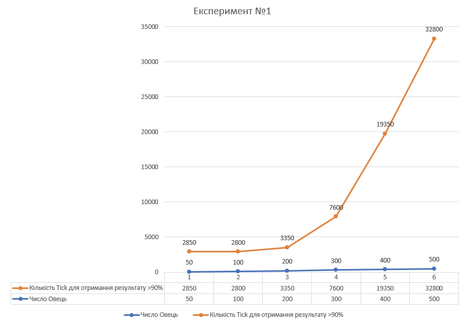
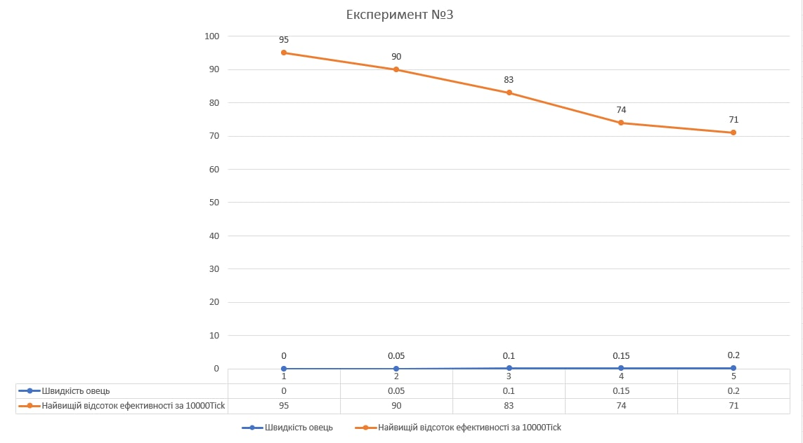

# Імітаційне моделювання комп'ютерних систем
## СПм-21-2, Лега Євгенія Сергіївна
### Додаткове завдання №**1_2**. Опис імітаційних моделей
 

### Обрана модель в середовищі NetLogo:

[Voting](http://www.netlogoweb.org/launch#http://www.netlogoweb.org/assets/modelslib/Sample%20Models/Social%20Science/Voting.nlogo)

 

### Вербальний опис моделі:
Симуляція голосування. Кожна клітинка голосує за 8 сусідів, що його оточують, та, в залежності від результату, змінювати свій голос. В моделі є два основні кольори:
синій та зелений, в залежності від того, якого кольору клітинки, що оточоють, клітинка обирає свій власний колір, тобто голосує.

### Керуючі параметри:

- change-vote-if-tied? параметр, коли дорівнює 1 змінює голос клітинки на протилежний, якщо сусіди проголосували 4-4. За замовчуванням при такому розкладі голос не змінюється
- award-close-calls-to-loser? параметр, коли дорівнює 1 при результаті голосування сусідів 5-3 віддає голос за програвшого.

### Внутрішні параметри:
- vote параметр, що містить значення власного голосу 0 або 1
- total параметр, що містить значення суми голосів усіх сусідів

### Критерії ефективності системи:
Ефективність даної системи можна виміряти кількістью часу що потрібно для повного розподілення голосів. Але дана система не мусить працювати швидко. 
Через це, пропонується інший варіант, система вважається ефективною, якщо вдалося змоделювати кінцевий результат.

### Примітки:
Під час моделювання системи з ввімкненими керуючими параметрами, система починає працювати з періодично однаковими значеннями. Тобто починається безкінечний цикл, коли деякі клітинки постійно змінюють своє значення.

### Недоліки моделі:
У моделі нажаль відсутнє відображення клітинки що вагається, тому важко відслідити, у яких саме клітин виникають проблеми з вибором. Також у моделі мало керуючих 
параметрів, можливо, було б цікаво додати можливість працювати на одному й тому самому початковому полі, для більш точного порівняння результатів.

 

## Обчислювальні експерименти 
### 1. Вплив кількості овець на швидкість отримання високого результату ефективності (>95%)
Проводиться експеримент як швидко зможуть пастухи упоратися зі стадом (ефективність >= 95%), кількість пастухів незмінна 50. Швидкість овець незмінна - 0.02. Кількість овець змінюється 50, 10 і далі з шагом у 100. Всього проводиться 6 симуляцій.

Графік показує, що розподіл до 4х овець на людину досить ефективний, коли стає овець більше, то пастухи не встигають піклуватися про всіх овець. Після 200 овець на паю потрібно дуже багато часу для отримання потрібної ефективності.

### 2. Вплив кількості пастухів на швидкість отримання високого результату ефективності (>95%)
Проводиться експеримент, де поступово збільшується кількість пастухів і перевіряється на скільки даний параметр допомагає пришвидшити отримання ефективного результату (ефективність >= 95%). Кількість овець - 150. Кількість пастухів 20 і далі з шагом в 20 до максимальної кількості - 100 пастухів. Швидкість овець незмінна - 0.02. Всього проводиться 5 симуляцій.

Графік показує, що чим більше пастухів, тим швидше вони зможуть організувати овець. Але окрім контрольного результату було проведені також тестові симуляції, де при збільшені кількості пастухів після 40 їх ефективність різко падала. Тобто була забагато пастухів на паю.

### 3. Вплив швидкості овець на ефективність 
Проводиться експеримент, де збільшується швидкість овець. Швидкість овець змінюється від 0 з шагом у 0.05 до максимального значення швидкості. На кожному з кроків замірюється найвище значення ефективності. Час симуляції 10000 тіків. Кількість пастухів та овець незмінна. Кількість пастухів - 50, кількість овець 150.

Графік показує, що зі збільшеням швидкості овець знижується результат ефективності. Це пов'язано з тим, що вівці починають розбігатися, навіть якщо їх поставили у стадо. При максимальній швидкості ефективність майже не відрізняється від початкової.
