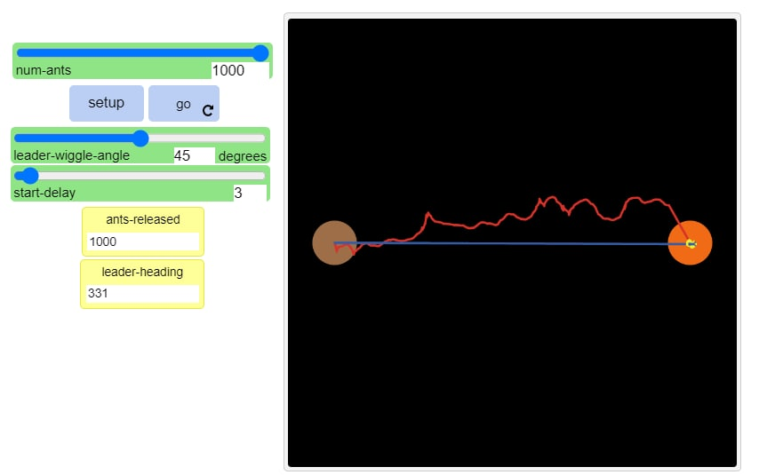

# Імітаційне моделювання комп'ютерних систем
## СПм-21-2, Лега Євгенія Сергіївна
### Додаткове завдання №**1_3**. Опис імітаційних моделей
 

### Обрана модель в середовищі NetLogo:

[Ant Lines](http://www.netlogoweb.org/launch#http://www.netlogoweb.org/assets/modelslib/Sample%20Models/Biology/Ant%20Lines.nlogo)

 

### Вербальний опис моделі:
Симуляція руху мурах, що йдуть за вожаком у пошуку їжі. Вожак рухається випадковим чином. Вожак рухається в цілому у напрямку їжі, але при кожному кроці може відхилятися від цілі. Рух вожака зображено червоною лінією. Коли вожак дістається до їжі, то він припиняє відхилятися. Після невеликої затримки за лідером починає йти друга мураха, направляючись туди де знаходиться вожак. Кожна наступна мураха слідує за ним таким самим чином. Остання мураха залишає за собою траєкторію синього кольору.

### Керуючі параметри:

- num-ants параметр, що визначає кількість мурах.
- leader-wiggle-angle параметр, який вказує величину, на скільки максимально може відхилятися вожак прикожному кроці.
- start delay параметр, що вказує крок між мурахами, які будуть рухатися одна за одною.

### Внутрішні параметри:
- nest-x nest-y  параметри, що містять координати локації центру гнізда  
- food-x food-y параметри, що містять координати локації центру їжі  

### Критерії ефективності системи:
- Ефективність даної системи є порівняння двох кривих, які утворюються в кінці. Чим пряміша є синя лінія, тим краще. Також критерієм ефективності можна вважати час, за який мурахи зможуть випрямити власний маршрут.
### Примітки:
Якщо мурах буде всього одна, то вона буде першою та останньою, тому вона буде мати синій колір. Якщо не ставити кут похибки для лідера, то лідер буде рухатися не обов'язково в бік їжі.

### Недоліки моделі:
Відсутність можливості зміни швидкості мурах. Можливо даний критерій зміг би повпливати на швидкість зміни їх траєкторії.
 

## Обчислювальні експерименти 
### 1. Вплив кількості мурах на досягнення максимального результат (синя лінія наближена до прямої)

При першому запуску моделы було зменшено кількість мурах до однієї. Як було вказано вище, коли мураха всього одна, то вона рухається як лідер, але при цьому має синій маркер. Результат першого запуску зображено нижче.

При другому запуску кількість мурах було збільшено до 50. Кут лідера залишається незмінним 45 градусів, а затримка мурах складає 3. Мурахам під час даного запуску не вдалося досягнути прямої лінії.

При третьому запуску було збільшено кількість мурах до 100. Результуюча пряма все більше починає бути схожу на пряму.

Кількість мурах поступово збільшується до 200. Результуюча пряма максимально наближена до ідеалу.

Після того як кількість мурах збільшується до 300, подальше збільшення задля знаходження ідеальної прямої не має сенсу. Коли шлях проходить 300 мурах, за будь-яких умов вони будуть мати ідеальну результуючу пряму.

Приклад експеременту з 500 мурахами.

Кількість мурах можна збільшувати до 1000. Приклад результуючої прямої зображений нижче.

Під час проведення даного експерименту було виявлено, що кількість мурах впливає на результуючу пряму. Але після 300 мурах збільшення забля вдосконалення результату не має сенсу. 

### 2. Вплив кута нахилу лідера мурахи на досягнення максимального результату (синя лінія наближена до прямої)

Проводиться експеримент з 200 мурахами та затримкою між мурахами у 3. Під час кожного запуску кут лідера змінювався від 0 до 90 градусів з кроком у 15. 
Під час першого запуску було обрано кут руху лідера 0. Як видно на скріншоті результуюча пряма досить наближена до ідеального результату та сильно відрізняється від початкової лінії.

Під час другого запуску було змінено градуси руху лідера на 15. Результуюча пряма не сильно відрізняється від прямої яка була отримана під час минулого запуску.

Третій запуск було проведено зі зміненими градусами, кут в даному запуску дорівнює 30. Результуюча пряма наближається до ідеальної.

Четвертий запуск має кут 45 градусів. Через те, що первинна пряма лідера не має дуже різкого зсуву як при перших запусках, результуюча пряма має ідеальний вигляд.

При куті у 60 градусів результуюча пряма наближена до ідеальної. Далі при зміненні кута результуюча ппряма майже не відрізняється. Відрізняється лише первина пряма лідера.

Запуск при куті 75 градусів.

Запуск 90 градусів.

Під час проведення даного експерименту було виявлено, що чим менше кут руху лідера, тим складніше мурахам в результаті утворити правильну пряму.

### 3. Вплив значення параметру затримки мурах на досягнення максимального результату (синя лінія наближена до прямої)

Проводиться експеримент де беруть участь 50 мурах, кут руху лідера дорівнює 45. Початкова затримка між мурахами дорівнює 1.
Результат даного експерименту представлено нижче. Результуюча пряма наближена до початкової прямої лідера.

При другому запуску затримку між мурахами було збільшено до 5. Результуюча пряма більше наближена до ідеальної.

Третій запуск має затримку у 5 мурах. Пряма ще більше наближається до ідеальної. Через не дуже вдалий початковий шлях лідера, пряма не мала ідеальний вигляд, хоча при інших запусках цього можна було досягти.

В четвертому запуску затримка складає 10. Цього більш ніж достатньо для утворення ідеальної прямої при кожному запуску. Подальше збільшення затримки не має сенсу.

В останньому запуску було збільшено затримку до максимальної. В даному випадку результуюча пряма завжди буде мати ідеальний вигляд.

Після проведення даного експерименту було зроблено висновок, що затримка у більш ніж 10 мурах не має сенсу. Адже мураха отримує координати мурахи, що попереду, а за 10 тіків мураха встигає добігти до їжі.
