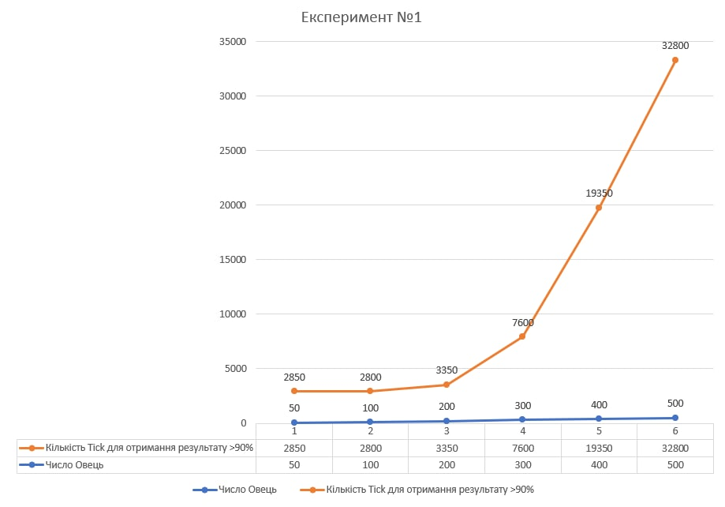
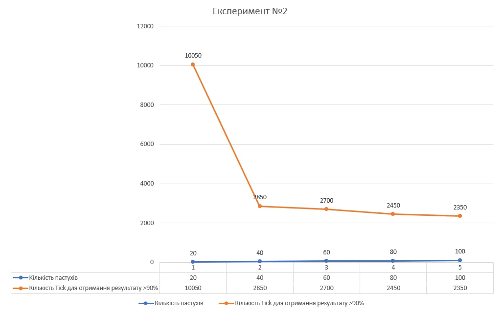
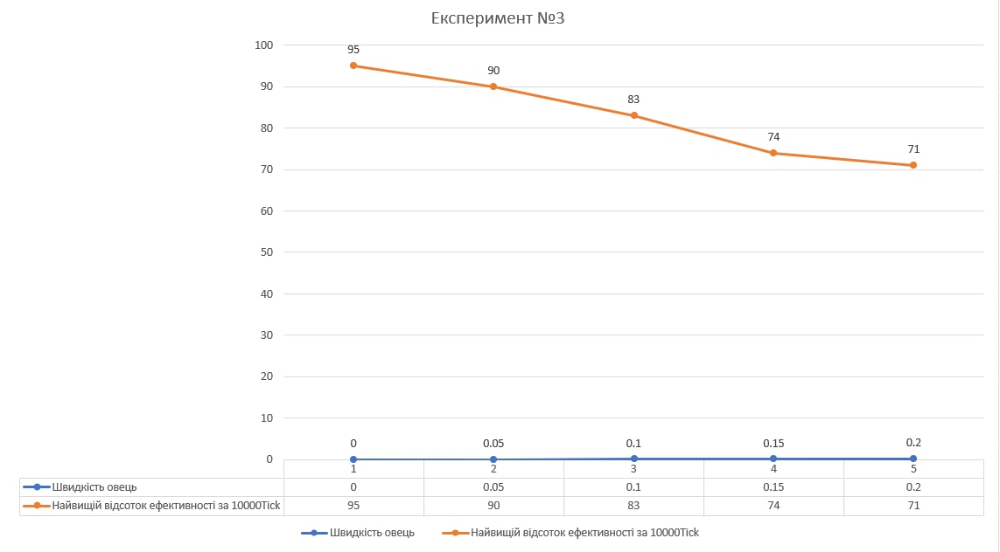

# Імітаційне моделювання комп'ютерних систем
## СПм-21-2, Лега Євгенія Сергіївна
### Лабораторна робота №**1**. Опис імітаційних моделей
 

### Обрана модель в середовищі NetLogo:

[Sheperds](http://www.netlogoweb.org/launch#http://www.netlogoweb.org/assets/modelslib/Sample%20Models/Biology/Shepherds.nlogo)

 

### Вербальний опис моделі:
Симуляція паю. В моделі є два агенти: пастухи та вівці. Вівці рухаються випадковим чином з зазначеною користувачем швидкістю. Пастухи намагаються їх пасти. Кожен пастух також рухається випадковим чином. Якщо пастух наткнувся на вівцю, то він її піднімає і продовжує рухатися, як тільки пастух наткнеться на іншу вівцю, він поставить вівцю, яку він ніс, поруч. Далі пастух продовжує шукати інших овець. Ідея - створити єдине стадо яке буде легше пасти.

### Керуючі параметри:

- num-sheep визначає число агентів у середовищі моделювання, тобто число овець на замкнутом полі.
- num-shepherds визначає число агенів у середовищі моделювання, в цьому випадку, число пастухів на замкнутому полі.
- sheep-speed визначає швидкість овець відносно пастухів.

### Внутрішні параметри:
- sheep-nearby. Кількість овець на сусідніх ділянках.
- carried-sheep. Параметр, що вказує чи хтось взяв вівцю чи ні.
- found-herd?. Параметр, який стає true, коли пастух знайшов стадо щоб поставити вівцю.
- herding-efficiency. Параметр, що вимірює на скільки гарно пасуться вівці. Чим більше пустих ділянок, тобто коли вівці в одному стадові, тим краще.
- sheepless-neighborhoods . Параметр, що показує на якій кількькості участків немає овець.

### Критерії ефективності системи:
- Ефективність випасу овець. Вимірюється кількістью пустих ділянок на пасовищі.
### Примітки:
Якщо пастухів більше ніж овець, то відбувається ситуація, коли усі пастухи забрали вівцю, а опустити її вже не можуть, адже немає інших овецб на полі. 
Результати експериментів також інколи залежать від розташування овець та пастухів.

### Недоліки моделі:
Відсутність можливості зміни швидкості пастухів. в реальному житті пастухи б не були швидші за овець, а у випадку даної системи, вівці завжди будуть повільніші аніж пастухи. Тому мало б сенс додати керуючий параметр для швидкості пастухів. І зробити швидкість вівець також окремим параметром, незалежним від швидкості пастуха. 

 

## Обчислювальні експерименти 
### 1. Вплив кількості овець на швидкість отримання високого результату ефективності (>95%)
Проводиться експеримент як швидко зможуть пастухи упоратися зі стадом (ефективність >= 95%), кількість пастухів незмінна 50. Швидкість овець незмінна - 0.02. Кількість овець змінюється 50, 10 і далі з шагом у 100. Всього проводиться 6 симуляцій.

Графік показує, що розподіл до 4х овець на людину досить ефективний, коли стає овець більше, то пастухи не встигають піклуватися про всіх овець. Після 200 овець на паю потрібно дуже багато часу для отримання потрібної ефективності.

### 2. Вплив кількості пастухів на швидкість отримання високого результату ефективності (>95%)
Проводиться експеримент, де поступово збільшується кількість пастухів і перевіряється на скільки даний параметр допомагає пришвидшити отримання ефективного результату (ефективність >= 95%). Кількість овець - 150. Кількість пастухів 20 і далі з шагом в 20 до максимальної кількості - 100 пастухів. Швидкість овець незмінна - 0.02. Всього проводиться 5 симуляцій.

Графік показує, що чим більше пастухів, тим швидше вони зможуть організувати овець. Але окрім контрольного результату було проведені також тестові симуляції, де при збільшені кількості пастухів після 40 їх ефективність різко падала. Тобто була забагато пастухів на паю.

### 3. Вплив швидкості овець на ефективність 
Проводиться експеримент, де збільшується швидкість овець. Швидкість овець змінюється від 0 з шагом у 0.05 до максимального значення швидкості. На кожному з кроків замірюється найвище значення ефективності. Час симуляції 10000 тіків. Кількість пастухів та овець незмінна. Кількість пастухів - 50, кількість овець 150.

Графік показує, що зі збільшеням швидкості овець знижується результат ефективності. Це пов'язано з тим, що вівці починають розбігатися, навіть якщо їх поставили у стадо. При максимальній швидкості ефективність майже не відрізняється від початкової.
