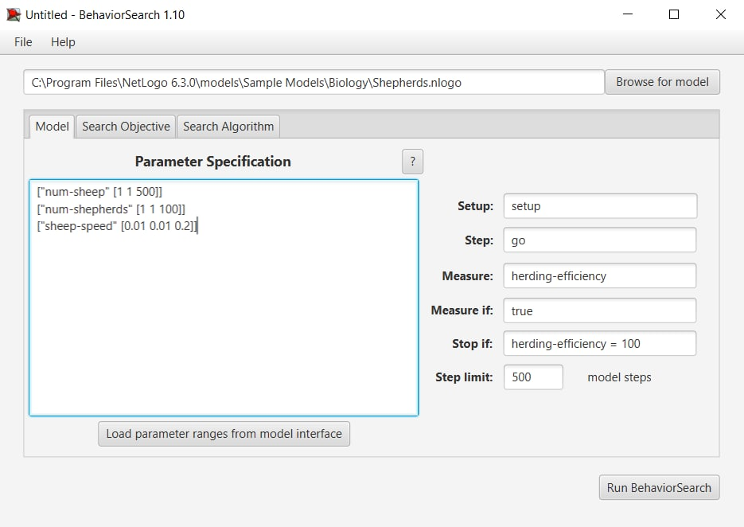
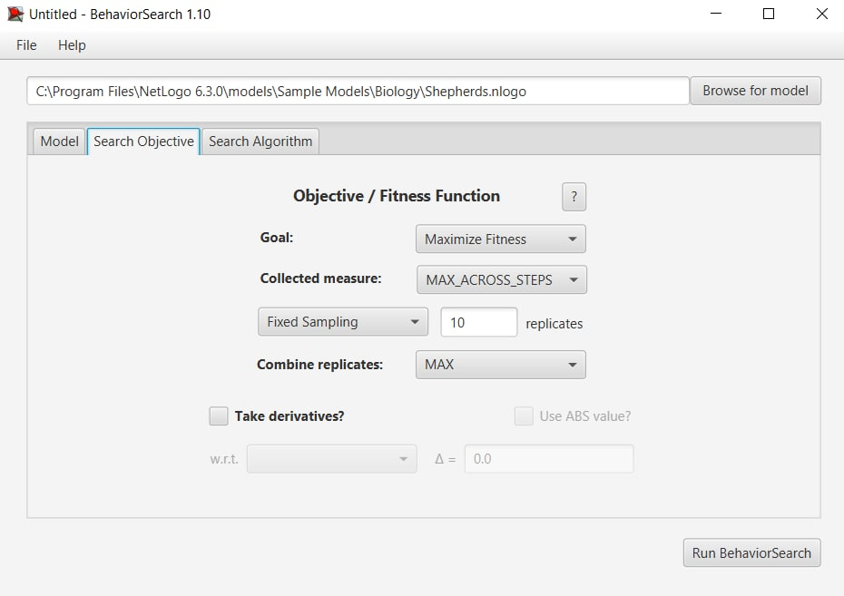
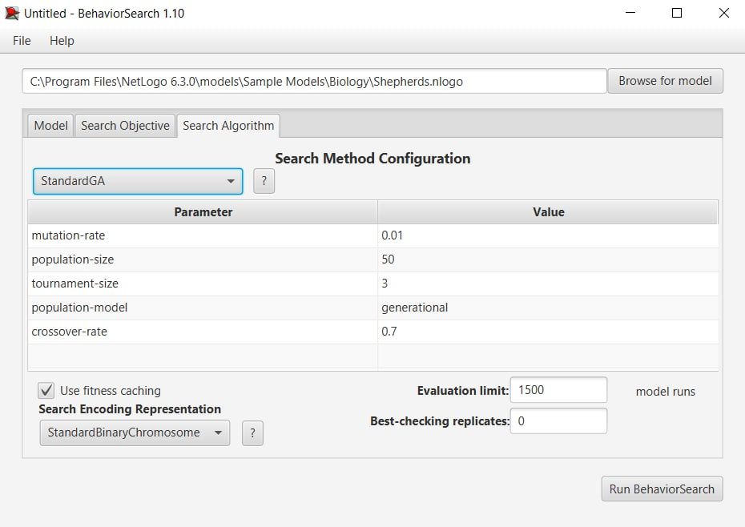
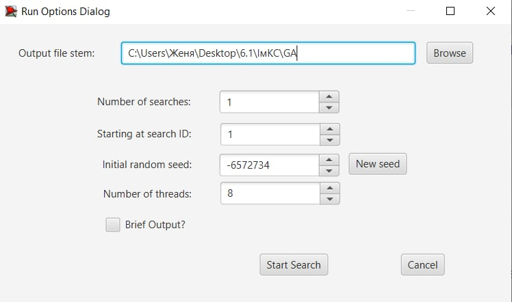
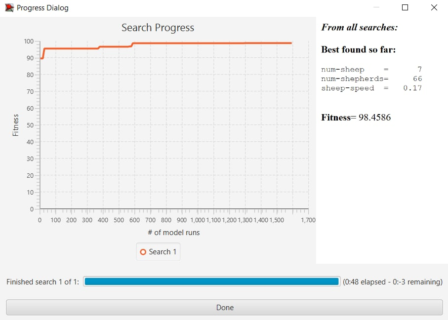
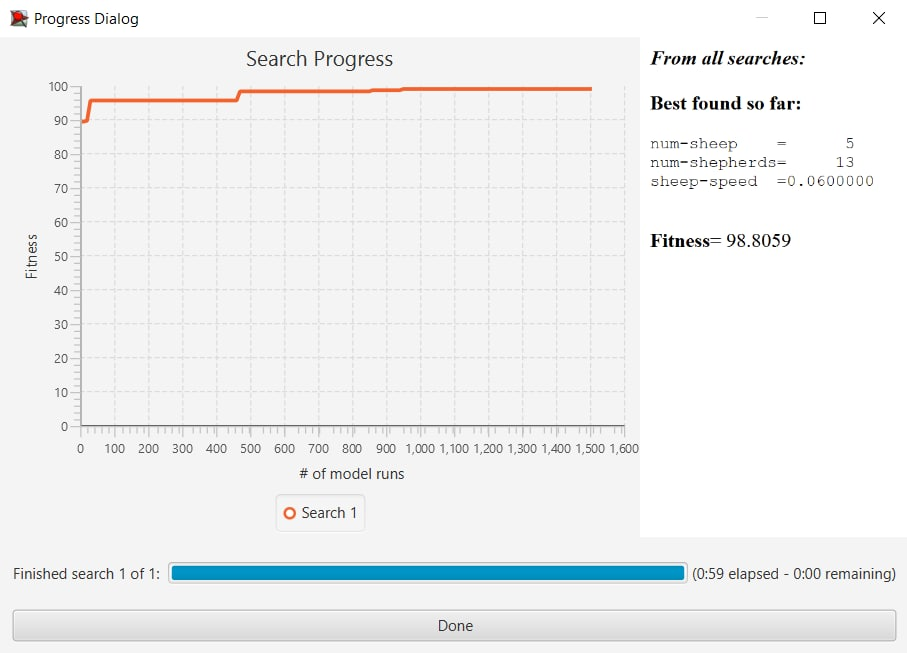

## Імітаційне моделювання комп'ютерних систем
## СПм-21-2, **Лега Євгенія Сергіївна**
### Лабораторная работа №**3**. Використання засобів обчислювального інтелекту для оптимізації імітаційних моделей

 

### Выбранная модель в среде NetLogo:
[Shepherds](http://www.netlogoweb.org/launch#http://www.netlogoweb.org/assets/modelslib/Sample%20Models/Biology/Shepherds.nlogo)

 

### Налаштування середовища BehaviorSearch:

**Обрана модель**:
<pre>
C:\Program Files\NetLogo 6.3.0\models\Sample Models\Biology\Shepherds.nlogo
</pre>
**Параметры модели**:  
<pre>
["num-sheep" [0 1 500]]
["num-shepherds" [0 1 100]]
["sheep-speed" [0 0.01 0.2]]
</pre>
Використовувана **міра**:  
Для фітнес-функції  - було обрано ** herding-efficiency **, дана змінна є глобальною змінною даної моделі.

Цікаво дізнатися саме максимально можливий результат ефективності даної системи. Тому оцінюється даний параметр та шукається його найбільше значення за період симуляції у 500 тактів. 
Средняя скорость всех машин на трассе должна учитываться **в среднем** за весь период симуляции длительностью 500 тактов (ведь на каждом такте есть своё значение текущей средней скорости), начиная с 0 такта симуляции.  
Параметр зупинки ("**Stop if**") в даному випадку використовувався, при умові якщо herding-efficiency = 100. Тобто коли буде симуляція при якій ефективність пасовища 100%, немає сенсу шукати інші параметри. 
Загальний вигляд вкладки налаштувань параметрів:

**Налаштування цільової функції** (Search Objective):  
Основна ідея підбору параметрів даної імітаційної моделі є максимізація значення параметру ефективності пасовища. Це показано через параментр Goal із значенням **Maximize Fitness**. Також було цікаво дізнатися не середнє, а найбільше значення за весь період симуляції на кожному такті. Тому інші параметри були обрані як **MAX_ACROSS_STEPS**
Для того, щоб не було спотворено результати через випадкові значення, **каждая симуляция повторяется по 10 раз**, результуюче значення розраховується як максимальне серед них.
Загальний вид вкладки налаштувань цільової функції:

**Налаштування алгоритму пошуку** (Search Algorithm):  
Загальний вигляд вкладки налаштувань алгоритму пошуку:

 

### Результати використання BehaviorSearch:

Діалогове вікно запуску пошуку:

Результат пошуку параметрів імітаційної моделі, використовуючи **генетичний алгоритм**:

Результат пошуку параметрів імітаційної моделі, використовуючи **випадковий пошук**:

